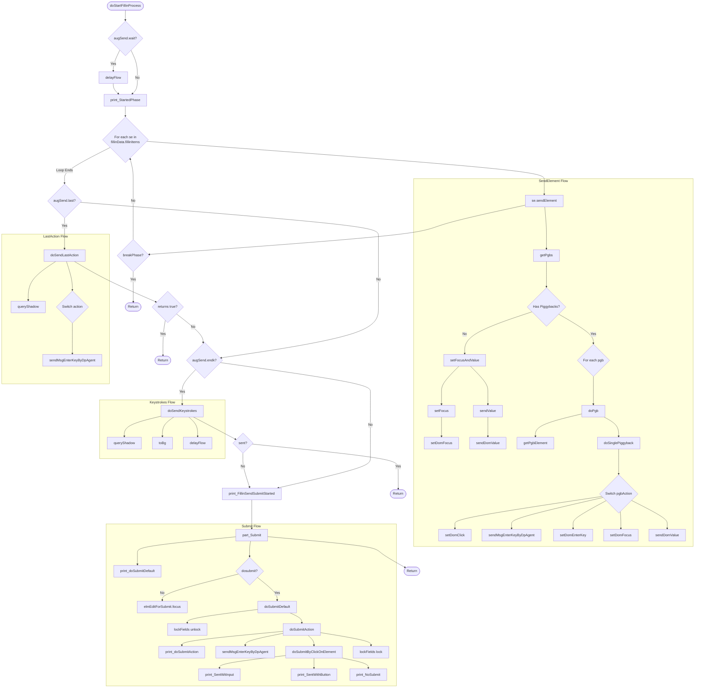

# Execution flow of doStartFillinProcess
_Exported on 5/11/2026 at 14:12:09 PDT from Cursor (3.3.30)_

---

**User**

There is a function called `doStartFillinProcess`. Is it possible to create a diagram illustrating what happens inside this function—specifically, which other functions it calls—that is, the entire execution flow of this function? @src/context-scripts/01-content.201.dog/7-process-fillin/0-all-start-loop.ts:14 

---

**Cursor**

Yes, I can create a diagram that illustrates the entire execution flow of the `doStartFillinProcess` function, including all the nested function calls it makes.

Here is a Mermaid diagram that visualizes the execution flow. You can view this diagram directly in the chat:

### Summary of the Execution Flow

